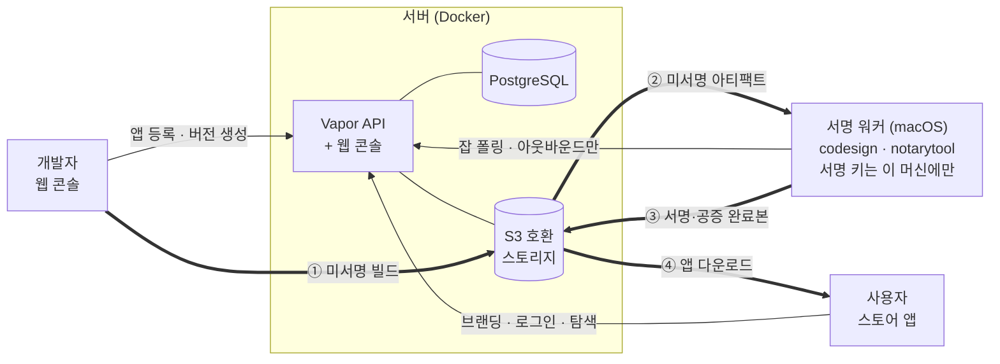
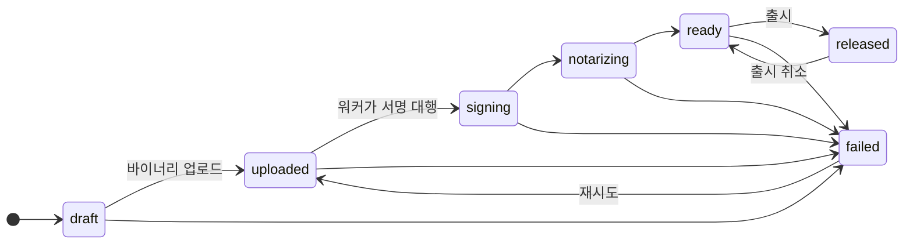
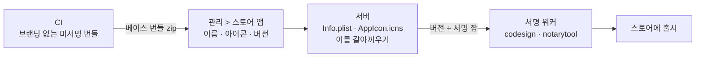

# Alley 설계 문서

조직 내부에서 macOS 앱을 배포하는 셀프호스팅 앱 스토어를 **무엇을 왜 이렇게**
만드는지에 대한 문서입니다.

무엇을 언제 만드는지는 [구현 계획](implementation-plan.md)을, 개별 결정의 배경과
버려진 대안은 [ADR](adr/README.md)을 보세요.

- 상태: 승인됨 (2026-08-12)
- 최종 갱신: 2026-08-13

---

## 1. 무엇을 만드는가

### 배경

조직 안에서 쓰는 Mac 앱을 나눠주는 과정은 보통 이렇습니다. 누군가 로컬에서 빌드하고,
서명하고, 공증을 기다리고, 결과물을 스토리지나 메신저로 올립니다. 받는 사람은 그게
최신인지, 누가 만들었는지, 안전한지 알기 어렵습니다.

Mac App Store를 쓰면 이 문제가 해결되지만, 조직 내부에서만 쓸 앱을 공개 스토어에
올릴 수는 없습니다. Alley는 그 사이의 빈자리를 채웁니다.

### 결정사항


| 항목       | 결정                                                       |
| -------- | -------------------------------------------------------- |
| 클라이언트    | 웹 콘솔(개발자용) + 네이티브 SwiftUI 스토어 앱(사용자용)                    |
| 배포 형태    | Docker 셀프호스팅. 서버 이미지는 CI 가 발행하고 운영은 그것을 받아 씀 (ADR-0021)      |
| 서명 파이프라인 | 서버 + macOS 서명 워커(pull 방식). 서명 키는 워커 머신에만                 |
| 기술 스택    | Swift 풀스택 (Vapor 서버 + Swift 워커 + SwiftUI 앱 + 공유 DTO 패키지) |
| 인증       | 표준 OIDC. 공급자는 설정으로 정한다 (ADR-0047). 허용 도메인은 서버 설정. 다운로드도 로그인 필수 |
| MVP 범위   | 코어 배포 루프 (로그인 → 업로드 → 자동 서명·공증 → 다운로드/설치)                |


### 왜 Swift 풀스택인가

세 계층(서버, 워커, 스토어 앱)이 같은 DTO 타입을 공유합니다. API 스펙이 어긋나면
런타임이 아니라 컴파일 단계에서 잡힙니다. 워커와 스토어 앱은 어차피 macOS 전용이라
Swift일 수밖에 없으므로, 서버까지 통일하면 한 팀이 전 계층을 유지보수할 수 있습니다.

절충한 부분도 있습니다. Vapor 생태계는 Node나 Go보다 작아서 없는 라이브러리는 직접
만들어야 할 수 있고, 기여자 풀이 "서버를 아는 Swift 개발자"로 좁아집니다. 이 프로젝트는
Apple 플랫폼 개발자가 주인이므로 이 절충을 받아들였습니다.

---

## 2. 코드 서명에 대해 짚고 갈 점

이 프로젝트의 설계는 macOS 코드 서명의 다음 사실 위에 서 있습니다.

### 서명하는 것은 인증서지 프로비저닝 프로필이 아니다

Developer ID 배포(App Store 외부 배포)에서 Gatekeeper가 보는 것은 두 가지입니다.

1. 유효한 **Developer ID Application 인증서** 서명
2. **Apple 공증(notarization)** 티켓

프로비저닝 프로필은 이 판단에 관여하지 않습니다. Apple의
[Developer ID 문서](https://developer.apple.com/support/developer-id)도 프로필 없는
앱을 정상 케이스로 전제합니다.

### 프로필이 필요한 경우

앱이 **restricted entitlement**를 쓸 때입니다. iCloud/CloudKit, Push Notifications,
App Groups, Sign in with Apple, Associated Domains, Network Extension, DriverKit 등이
여기 해당합니다. 이 경우 프로필이 없으면 Gatekeeper 경고가 아니라 entitlement 검증
실패로 앱이 실행되지 않습니다.

Xcode의 자동 서명이 Developer ID 빌드에서도 App ID와 프로필을 만들어주기 때문에
"항상 필요한 것"으로 오해하기 쉽습니다.

### 설계에 미치는 영향

서명·공증을 스토어가 대행하므로 **개발자는 인증서를 직접 다룰 필요가 없습니다.**
이것이 이 프로젝트가 제공하는 실질적인 편의입니다.

다만 restricted entitlement를 쓰는 앱은 `Contents/embedded.provisionprofile`이
**서명 이전에** 번들 안에 있어야 하므로, 개발자가 업로드하는 번들에 프로필이 이미
포함돼 있어야 합니다. 워커는 업로드된 번들의 entitlements를 검사해서, restricted
항목이 있는데 프로필이 없으면 서명 전에 명확한 에러로 실패시킵니다. 서명은 됐지만
실행되지 않는 앱이 배포되는 상황을 막기 위해서입니다.

---

## 3. 번들 ID와 App ID 관리 정책

번들 ID와 개발자 포털의 App ID는 다른 개념이므로 분리해서 다룹니다.

### 번들 ID는 앱마다 고유해야 한다

공유할 수 없습니다. macOS가 번들 ID를 기준으로 LaunchServices 앱 등록,
`UserDefaults` 도메인, Application Support 경로, 키체인 접근 그룹, TCC 권한
(카메라/마이크/화면 녹화) 승인 단위를 결정하기 때문입니다. 스토어 DB의
`apps.bundle_id`도 유니크 키입니다.

### 포털의 App ID는 와일드카드로 묶을 수 있다

조직의 개발자 계정에 App ID 엔트리가 쌓이는 것을 막기 위해 3단 정책을 씁니다.


| 앱 유형                                                                    | 포털 등록                                 | 비고                         |
| ----------------------------------------------------------------------- | ------------------------------------- | -------------------------- |
| 대부분의 내부 앱                                                               | **등록 없음**                             | 번들 ID만 고유하게. 서명 + 공증만으로 배포 |
| 프로필은 필요하나 특수 capability 없음                                              | **와일드카드 App ID 1개 공유** (`<prefix>.*`) | 포털에 엔트리 하나만 유지             |
| Push / iCloud / App Groups / Sign in with Apple / Associated Domains 사용 | explicit App ID 개별 등록                 | 와일드카드로 커버 불가능              |


### 스토어가 ID 대장 역할을 한다

번들 ID 프리픽스는 서버 설정값 `BUNDLE_ID_PREFIX`로 둡니다. 스토어는 앱 등록 시
프리픽스 준수와 중복 여부를 검증하고, 등록된 번들 ID 목록을 웹 콘솔에서 조회할 수
있게 합니다. 포털의 엔트리는 최소로 유지하면서 실제 ID 관리 책임은 스토어가 가져갑니다.

---

## 4. 아키텍처



**굵은 화살표는 바이너리**입니다. presigned URL로 스토리지와 직접 오가므로 서버를
통과하지 않습니다. 번호는 빌드 하나가 개발자에서 사용자에게 닿기까지의 순서입니다.

그래서 **스토리지 주소는 둘입니다.** 서버가 붙는 주소와, 클라이언트에게 내주는 주소가
같으리라는 보장이 없습니다. presigned URL의 서명은 호스트를 포함해서 계산되므로 서명은
클라이언트가 실제로 붙을 주소에 대해 이뤄져야 합니다
([ADR-0024](adr/0024-storage-prefix-endpoints-credentials.md)).

**얇은 화살표는 API 호출**이고, 화살표 방향이 곧 연결을 시작하는 쪽입니다.
워커에서 서버로만 향한다는 점이 중요합니다. 서명 키를 보관한 머신에 인바운드
포트를 열지 않습니다.

스토어 앱은 붙을 서버 주소를 `Info.plist`에 박고 나갑니다. 값은 조립할 때 들어오고
소스에는 없습니다([ADR-0044](adr/0044-store-app-knows-its-server.md)). 주소 없이 만든
빌드는 최초 실행 시 사람에게 묻습니다. 어느 쪽이든 브랜딩과 인증 설정은
`/api/v1/meta`로 받아옵니다.

### 서명 워커가 pull 방식인 이유

워커는 서버로 **나가는 방향으로만** 통신합니다(long-poll). 서명 키를 보관한 머신에
외부에서 들어오는 포트를 열 필요가 없습니다. 서버를 컨테이너 플랫폼에 두고 워커만
격리된 물리 머신에 두는 구성이 자연스럽게 나옵니다.

대안으로 서명 머신에 서버 전체를 올리는 방법도 있었지만, 서비스 가용성이 빌드 머신에
묶이고 macOS에서의 서버 운영 부담이 커지며, 셀프호스팅 진입장벽이 생겨서 택하지
않았습니다. 바이너리 왕복 전송 비용은 공증 대기 시간(수 분)에 비하면 무시할 수준입니다.

### 조직 중립성 원칙

이 프로젝트는 오픈소스 공개를 전제로 합니다.

- 애플리케이션 코드는 표준 인터페이스만 압니다: PostgreSQL URL, S3 호환 엔드포인트,
SMTP, Slack Webhook URL. 전부 환경변수 주입
- 스토리지는 버킷 하나를 통째로 쓴다고 가정하지 않습니다. 버킷 안의 프리픽스 하나만
소유하는 배포도, 액세스 키 없이 인스턴스에 붙은 역할로 인증하는 배포도 설정으로
받습니다 ([ADR-0024](adr/0024-storage-prefix-endpoints-credentials.md))
- 특정 조직의 이름, 내부 호스트, 실제 계정 주소가 코드에 등장하지 않습니다
- 스토어 이름/로고/색상/허용 도메인은 서버가 `GET /api/v1/meta`로 내려줍니다.
클라이언트 바이너리에는 조직 고유값이 들어가지 않습니다
- 조직별 배포 매니페스트(플랫폼 설정, 시크릿, 도메인)는 이 레포 밖에 둡니다
- `scripts/check-denylist.sh`가 CI에서 이 원칙을 강제합니다

### 레포 구조

```
alley-store/
├── Package.swift
├── Sources/
│   ├── AlleyShared/       # DTO, API 경로 (서버·워커·앱 공유, 외부 의존 없음)
│   ├── AlleyProcess/      # 외부 명령 실행 (워커·앱이 codesign 등을 부른다)
│   ├── AlleyServer/       # Vapor API 서버 + 웹 콘솔
│   ├── AlleyWorkerCore/   # 서명 워커의 동작
│   ├── AlleyWorker/       # 워커 실행 파일
│   ├── AlleyStoreCore/    # SwiftUI 스토어 앱 (macOS 전용)
│   ├── AlleyStore/        # 앱 실행 파일
│   ├── AlleyCLICore/      # CI 에서 버전을 올리는 alley 명령
│   └── AlleyCLI/          # CLI 실행 파일
├── Tests/
├── Resources/Views/       # 웹 콘솔 Leaf 템플릿
├── Public/                # 웹 콘솔 정적 파일 (CSS, 업로드 스크립트)
├── scripts/               # 워커·앱 번들 조립과 설치, 금칙어·자격증명 검사
├── docker-compose.yml          # 발행된 이미지를 받아 띄운다
├── docker-compose.override.yml # 로컬에서는 소스로 짓는다 (ADR-0021)
├── Dockerfile
└── docs/
```

실행 파일 타깃(`AlleyWorker`, `AlleyStore`)은 진입점 한 줄만 갖고 나머지는 라이브러리
타깃에 둡니다. 테스트가 `main.swift` 를 가진 타깃을 그대로 임포트할 수 없기 때문입니다.
스토어 앱 타깃은 `#if os(macOS)` 로 감싸서 리눅스에서는 아예 만들어지지 않습니다.

`AlleyShared`는 Vapor를 포함해 어떤 외부 프레임워크에도 의존하지 않습니다.
SwiftUI 스토어 앱이 그대로 임포트해야 하기 때문입니다. HTTP 직렬화 능력은
서버 쪽에서 덧붙입니다.

웹 콘솔은 MVP에서 Vapor + Leaf 서버 렌더링에 최소한의 JS로 갑니다. 스크립트를 쓰는
자리는 두 갈래로 나뉩니다([ADR-0030](adr/0030-read-bundle-info-in-browser.md)).

- **없으면 안 되는 곳**: 버전 업로드. 브라우저가 스토리지로 직접 올리고 진행률을
  보여줘야 합니다([ADR-0012](adr/0012-browser-upload-script.md))
- **없어도 되는 곳**: 새 앱 등록과 버전 업로드의 자동 채우기. 고른 zip 의
  `Info.plist` 를 읽어 입력칸을 채우기만 합니다. 스크립트가 없으면 사람이 적으면
  되고, 그때는 그 칸 자체를 감춥니다

화면이 복잡해지면(통계, 피드백 대시보드) 그때 SPA 전환을 검토합니다.

스토어 앱은 Xcode 프로젝트 없이 SwiftPM 타깃과 번들 조립 스크립트로 만듭니다
([ADR-0014](adr/0014-store-app-without-xcode-project.md)).

---

## 5. 핵심 설계

### 5.1 인증

- 표준 OIDC Authorization Code 플로우. 서버가 콜백을 받아 자체 세션 토큰(JWT) 발급
- **공급자는 조직이 정합니다** (ADR-0047). `OIDC_ISSUER` 하나만 주면 나머지 주소는
서버가 `{issuer}/.well-known/openid-configuration` 에서 읽어옵니다. Google Workspace,
Microsoft Entra ID, Okta, Keycloak 이 같은 길로 지나갑니다. 비워두면 Google 입니다
- ID 토큰은 공급자의 JWKS 로 서명을 검증하고 `iss` 와 `aud` 를 확인합니다
- 이메일 도메인을 **서버 측에서** 허용 도메인 설정과 대조합니다. 클라이언트 검증만으로는
우회할 수 있으므로 반드시 서버에서 봅니다. `email_verified`도 확인합니다.
Google 에서는 `hd`(hosted domain) claim 까지 함께 봅니다. 그 claim 은 Google 고유라
다른 공급자에서는 이메일 도메인만 남습니다
- 사용자 식별자는 `issuer` + `sub` 입니다. `sub` 는 공급자 안에서만 유일합니다
- 스토어 앱은 `ASWebAuthenticationSession`으로 같은 서버 플로우를 태웁니다
(커스텀 URL 스킴 콜백)
- 역할: `admin` / `developer` / `user`
  - 최초 로그인 시 기본 `user`
  - 서버 설정의 초기 관리자 목록에 있으면 `admin`
  - `admin`이 웹 콘솔에서 `developer`로 승격
- 다운로드 API도 인증 필수. 누가 언제 무슨 버전을 받았는지 기록합니다

#### 브라우저 쪽 방어

웹 콘솔은 쿠키로 인증합니다. 브라우저가 쿠키를 알아서 붙여주기 때문에, 로그인한
사용자를 시켜 우리 서버에 요청을 보내게 만드는 공격이 성립합니다. 두 겹으로 막습니다.

- **다른 사이트가 보낸 요청**은 `OriginCheckMiddleware`가 `Origin`을 보고 거절합니다
  (ADR-0010 후속). 쿠키로 인증된 상태 변경 요청만 검사합니다
- **다른 사이트가 우리 화면을 iframe으로 덮는 것**은 위 검사로 막히지 않습니다.
  그때 `Origin`은 우리 것이라 통과합니다. `Content-Security-Policy`의
  `frame-ancestors 'none'`이 그 문을 닫습니다
  ([ADR-0026](adr/0026-security-headers.md))

보안 헤더는 미들웨어 스택의 가장 바깥에서 모든 응답에 붙습니다. 오류 처리가
만들어낸 404 화면에도 붙어야 하기 때문입니다.

배포 설정이 이 방어를 무르게 만드는 자리가 있습니다. 세션 쿠키의 `Secure`가
`PUBLIC_BASE_URL`의 스킴으로 정해집니다. 그래서 기동 시점에 그 값과 `JWT_SECRET`
길이를 검사하고, 어긋나면 뜨지 않습니다 ([ADR-0027](adr/0027-fail-fast-on-unsafe-config.md)).

### 5.2 데이터 모델


| 테이블              | 주요 필드                                                      |
| ---------------- | ---------------------------------------------------------- |
| `users`          | google_sub, email, name, avatar_url, role                  |
| `store_settings` | 스토어 이름, 로고, 강조색, 허용 도메인, 번들 ID 프리픽스 (singleton, [ADR-0011](adr/0011-store-settings-in-database.md)) |
| `branding_assets` | 종류(파비콘·로고·앱 아이콘), 스토리지 키, 크기 ([ADR-0045](adr/0045-branding-assets-in-storage.md)) |
| `store_app_settings` | 스토어 앱의 번들 ID·이름·URL 스킴·베이스 번들 (singleton, [ADR-0046](adr/0046-server-assembles-store-app.md)) |
| `apps`           | bundle_id, 이름, 아이콘, 설명, 카테고리, owner_id                     |
| `app_members`    | app_id, user_id (앱별 업로드 권한)                                |
| `versions`       | app_id, short_version, build_number, 릴리즈 노트, min_macos, 상태, entitlements ([ADR-0020](adr/0020-uploader-provides-entitlements.md)) |
| `artifacts`      | version_id, kind(unsigned/signed), s3_key, sha256, size    |
| `signing_jobs`   | version_id, 상태, worker_id, 로그, 시도 횟수                       |
| `workers`        | 이름, 토큰 해시, 마지막 폴링 시각                                       |
| `downloads`      | user_id, version_id, timestamp                             |
| `deploy_tokens`  | app_id, 이름, 토큰 해시 (CI 업로드용, ADR-0015)                     |
| `feed_tokens`    | app_id, 이름, 토큰 해시 (Sparkle 피드용, ADR-0017)                 |
| `feedback`       | app_id, version_id, user_id, 별점, 글, 스크린샷, 익명 여부             |
| `notification_targets` | app_id(nullable), 종류, 이름, 엔드포인트                     |


버전 상태 머신:



**모든 업로드가 워커를 지납니다.** 이미 서명·공증을 마친 번들이어도 그렇습니다.
워커가 번들을 열어보고 서명이 다 됐다고 판정하면 서명·공증만 건너뛰고, 상태는
같은 길을 지납니다 ([ADR-0035](adr/0035-worker-decides-signing-state.md)).
실패하면 업로드된 바이너리부터 다시 시작합니다.

전이 규칙은 `VersionState.allowedNextStates`에 박아두어 단계를 건너뛰는 경로를
타입 수준에서 막습니다. 위 그림과 코드가 어긋나면 코드가 기준입니다.

`draft`에서 아무 데도 가지 못한 버전은 서버가 지웁니다. 업로드를 시작만 하고 완료를
알리지 않으면 행과 오브젝트가 계속 쌓이기 때문입니다. 보관 기간과 그 대가는
[ADR-0019](adr/0019-abandoned-draft-cleanup.md)에 있습니다.

### 5.3 서명 워커

- 서명·공증된 `.app` 번들 + `launchd` LaunchAgent. 설치 스크립트 제공. 번들을 한 번
  만들어 여러 워커 맥에 나눠주므로 워커 맥에는 소스도 Swift 툴체인도 필요 없습니다.
  조립·서명 경로는 스토어 앱과 공통이고(`scripts/lib/bundle.sh`), UI 가 없는데도 번들로
  만드는 것은 공증 티켓을 스테이플할 자리가 필요해서입니다
  ([ADR-0022](adr/0022-worker-as-signed-app-bundle.md))
- 워커가 서버로 long-poll (`GET /api/v1/worker/jobs/next`). 인바운드 포트 불필요
- 워커 등록: 관리자가 웹 콘솔에서 토큰 발급 → 워커 설정에 기입
- 잡 처리 순서:
  1. 잡 클레임 → presigned URL로 미서명 아티팩트 다운로드
  2. entitlements 검사 (restricted 항목이 있는데 프로필이 없으면 여기서 실패.
   Electron 인데 JIT 권한이 없어도 여기서 실패)
  3. `codesign --force --options runtime --sign "..."` (내부 프레임워크·헬퍼 포함
   inside-out 서명)
  4. 번들 안의 Mach-O 를 훑어 재서명되지 않은 것이 남았는지 따로 센다.
   `codesign --verify --deep --strict` 는 프레임워크 안의 dylib 이 링커가 붙인
   ad-hoc 서명 그대로 남아 있어도 통과시킨다
  5. `xcrun notarytool submit --wait`
  6. `xcrun stapler staple`
  7. 결과물을 presigned URL로 업로드, 상태·로그 보고

#### 서명할 때 붙이는 entitlements

Hardened Runtime은 공증 요건이라 언제나 켭니다. 그런데 그 아래에서 앱이 무엇을 할 수
있는지는 entitlements가 정합니다. 붙일 것을 어디서 얻는지는 두 갈래입니다.

- **업로더가 준 것이 있으면 그것을 씁니다.** 미서명 업로드에는 읽어낼 기존 서명이 없어서
워커가 짐작할 방법이 없습니다. 앱이 무슨 권한을 쓰는지는 그 앱을 만든 사람만 압니다
([ADR-0020](adr/0020-uploader-provides-entitlements.md))
- **없으면 각 대상의 기존 서명에서 읽어 다시 붙입니다.** 서명된 앱을 재서명하는 경우가
여기 해당합니다. `codesign`은 재서명할 때 이전 권한을 물려주지 않습니다

업로더가 준 plist는 `.app` 번들에만 붙입니다. 메인 앱과 그 안의 헬퍼 `.app`이 여기
해당합니다. 프레임워크와 dylib, 홀로 놓인 헬퍼 실행 파일에는 붙이지 않습니다.
`--entitlements`는 번들의 주 실행 파일에 쓰는 것입니다.

Electron 앱은 `com.apple.security.cs.allow-jit` 없이 Hardened Runtime 아래에서 V8을
띄우면 실행되자마자 죽습니다. **그 상태로도 공증은 통과합니다.** 그래서 번들에 Electron
Framework가 있는데 이 권한이 없으면 서명하기 전에 실패시킵니다. 이 검사는 Electron만
알고 다른 JIT 런타임은 잡지 못합니다. 그 한계는 ADR-0020에 적었습니다.
- 공증 자격증명은 환경변수가 아니라 `notarytool` 키체인 프로필 방식을 씁니다.
자격증명이 프로세스 환경에 노출되지 않습니다
- `alley-worker preflight`로 설치 직후 환경을 점검합니다. 잡을 받은 뒤에 환경 문제를
발견하면 원인 파악이 번거롭기 때문입니다
- 워커를 여러 대 등록할 수 있게 설계합니다. 큐가 서버에 있으므로 워커가 죽어도
복구 시 이어서 처리합니다
- 워커가 잡을 가져간 채로 죽으면 서버가 그 잡을 큐로 되돌립니다. 하트비트가 끊긴
`running` 잡을 주기적으로 훑고, 시도 상한을 넘기면 실패로 확정합니다
([ADR-0018](adr/0018-stalled-signing-job-recovery.md))

#### 실패를 갈래로 나눈다

워커는 실패를 보고할 때 문자열만이 아니라 갈래(`SigningFailureCode`)를 함께 보냅니다.
**다시 해도 소용없는 것과 다시 해볼 만한 것을 서버가 구분할 수 있어야** 하기
때문입니다. 인증서 만료는 세 번을 더 해도 같은 결과이고, 네트워크가 한 번 끊긴 것은
다시 하면 됩니다 ([ADR-0023](adr/0023-signing-failure-codes.md)).

- 재시도 여부의 판단은 코드 자신이 갖습니다(`isRetriable`). 서버가 문자열을 다시
해석하는 자리는 없습니다
- 갈래는 워커가 오류 타입에서 뽑습니다. `codesign` 과 `notarytool` 의 출력을 보는 곳이
두 군데 있는데, 종료 코드로는 나눌 수 없어서 그렇습니다. Apple 이 문구를 바꾸면
그 두 곳은 조용히 틀립니다
- **분류하지 못한 실패(`unknown`)는 재시도하지 않습니다.** 잘못된 재시도는 같은 버전을
공증에 두 번 올리고, 자동으로 넘어가면 분류를 늘려야 한다는 신호가 묻힙니다
- 워커가 죽어 아무것도 보고하지 못한 잡은 갈래가 **없습니다.** 그 경우는 예전처럼 시도
상한만 봅니다. "갈래가 없다"와 "분류하지 못했다"는 다릅니다

잡 로그는 덮어쓰지 않고 단계마다 쌓습니다. 실패 원인을 찾을 때 필요한 것은 실패
메시지 자체보다 그 직전 단계가 무엇을 하고 있었는가입니다. 상한은 16KB 이고 넘으면
앞을 버립니다. 원인은 대개 끝에 있습니다.

화면에는 코드 대신 무엇을 해야 하는지를 한국어로 씁니다(`SigningFailureGuidance`).
코드는 지원 문의에 적을 수 있도록 문장 옆에 작게 둡니다.

### 5.4 스토어 앱

- 최초 실행: 번들에 박힌 주소로 연결 → `/api/v1/meta`로 브랜딩·인증 설정 수신
  ([ADR-0044](adr/0044-store-app-knows-its-server.md))
- 주소 없이 만든 빌드만 주소를 입력받습니다. 개발과 셀프호스팅 시연이 그 빌드를 씁니다
- 로그인 → 앱 목록/검색/상세 → presigned URL 다운로드 → 설치
- 스토어 앱 자체의 첫 배포는 웹 콘솔에서 직접 다운로드합니다 (부트스트랩)

**웹 다운로드는 스토어 앱에만 엽니다.** 다른 앱에 열면 스토어 앱이 하는 검증을
건너뛰는 기본 경로가 됩니다. 그중 "이미 깔린 같은 앱과 서명한 팀이 같은가" 는 로컬에
무엇이 깔렸는지 알아야만 판단할 수 있어서 브라우저에서는 재현할 수 없습니다. 예외는
올릴 권한이 있는 사람입니다. 그 사람들은 어차피 올린 파일을 갖고 있고 서명 결과를
확인할 이유가 있습니다.

#### 스토어 앱은 서버가 조립한다

조직마다 다른 것(이름, 번들 ID, URL 스킴, 아이콘)을 **관리 화면에서 정하고 서버가
번들에 넣습니다** ([ADR-0046](adr/0046-server-assembles-store-app.md)).



서버가 맥이 아닌데도 할 수 있는 것은 **바꿀 것이 전부 파일 몇 개**여서입니다. 압축을
풀지 않고, 손대지 않는 항목은 압축된 바이트 그대로 옮깁니다. 워커는 이것이 스토어
앱인지 모르고 다른 앱과 같게 처리합니다.

빌드 번호는 서버가 정해 번들의 `CFBundleVersion` 과 스토어의 빌드 번호에 **같은 값**을
씁니다. 정하는 곳이 둘이면 설치된 앱이 자기를 최신이라고 말합니다.

**실행 파일 이름은 ASCII 로 만듭니다.** 비ASCII 문자가 들어가면
`codesign --verify --deep --strict` 가 번들을 거절하는데, 그 실패는 서명이 끝난 뒤에
`a sealed resource is missing or invalid` 한 줄로만 나옵니다. `.app` 폴더 이름과 화면에
보이는 이름은 적은 그대로 둡니다.

#### 샌드박스를 쓰지 않는다

스토어 앱은 App Sandbox 없이, Hardened Runtime만 켜서 배포합니다.

이 앱이 하는 일은 `/Applications`에 앱을 쓰고, 업데이트할 때 실행 중인 대상 앱에
종료를 요청하는 것입니다. 샌드박스는 정확히 그 둘을 막습니다. 우회하려면 사용자가
매번 설치 위치를 직접 고르거나 별도 권한 헬퍼를 두어야 하는데, 보안은 늘지 않고
사용성만 나빠집니다. Developer ID 배포는 샌드박스를 요구하지도 않습니다.

대신 다음으로 방어합니다.

- **Hardened Runtime** (공증 요건이기도 합니다)
- **설치 전 서명 검증**: 내려받은 앱을 `codesign --verify --deep --strict`로 확인하고
Team ID가 기대값과 같은지 대조합니다. 서버가 침해되어 다른 바이너리를 내려줘도
클라이언트에서 걸립니다. 스토어 앱을 샌드박싱하는 것보다 이쪽이 실질적입니다
- **SHA-256 대조**: 서버가 알려준 해시와 내려받은 파일을 대조합니다
- **quarantine 속성 유지**: 첫 실행 시 macOS 표준 Gatekeeper 검증을 그대로 태웁니다

#### 설치 위치

`/Applications`가 기본입니다. 관리자 계정이면 그대로 쓰고, 쓰기 권한이 없으면
`~/Applications`로 폴백합니다. 폴백했다는 사실을 사용자에게 알립니다.

### 5.5 앱 업데이트

업데이트 경로를 두 갈래로 지원합니다. 스토어 앱이 관리하는 경로가 기본이고,
개별 앱이 스스로 업데이트하고 싶으면 Sparkle을 붙일 수 있습니다.

#### 왜 두 갈래인가

스토어 앱만으로 가면 스토어 앱이 안 떠 있는 동안에는 업데이트가 안 됩니다.
Sparkle만으로 가면 모든 앱에 SDK를 통합해야 하고, 통합하지 않은 앱은 영영
업데이트되지 않습니다. 둘 다 열어두면 앱 개발자가 상황에 맞게 고를 수 있고,
이미 Sparkle을 쓰던 앱은 서버 URL만 바꿔서 그대로 흡수됩니다.

appcast는 XML 엔드포인트 하나라 구현 비용이 거의 없습니다.

#### 경로 A: 스토어 앱이 관리

설치된 앱 탐지:

1. `/Applications`와 `~/Applications`를 스캔해 각 번들의 `CFBundleIdentifier`와
 `CFBundleVersion`을 읽습니다
2. 스토어에 등록된 번들 ID와 대조해 설치 여부와 버전을 판단합니다
3. 사용자가 다른 위치에 설치한 앱은 `NSWorkspace.urlForApplication(withBundleIdentifier:)`로
 보완 조회합니다. 그래도 못 찾으면 미설치로 간주하고, 설치를 시도할 때 중복이
 감지되면 사용자에게 알립니다

교체 절차:

1. 새 버전을 받아 서명·해시를 검증합니다 (5.4의 설치 전 검증과 동일)
2. 대상 앱이 실행 중이면 사용자에게 알리고 동의를 받은 뒤
 `NSRunningApplication.terminate()`로 정상 종료를 요청합니다. 응답이 없으면
 강제 종료하지 않고 "나중에 업데이트"로 미룹니다. 저장하지 않은 작업을
 날리는 것보다 업데이트가 늦는 편이 낫습니다
3. 기존 번들을 휴지통으로 옮기고 새 번들을 같은 위치에 놓습니다.
 교체 중 실패하면 옮겨둔 기존 번들을 되돌립니다
4. 업데이트 전에 실행 중이었다면 다시 실행합니다

MVP에서는 사용자가 버튼을 눌러 업데이트합니다. 백그라운드 자동 확인은 Phase 4입니다.

#### 경로 B: Sparkle appcast

서버가 앱별로 appcast를 서빙합니다.

```
GET /api/v1/apps/:id/feed/:token/appcast.xml
```

앱에 Sparkle을 통합하고 이 URL을 `SUFeedURL`로 지정하면 스토어 앱 없이도 자체
업데이트가 됩니다. appcast에는 released 상태인 버전만 나갑니다.

인증이 문제가 됩니다. 다른 API는 전부 로그인을 요구하는데 Sparkle은 세션 토큰을
들고 있지 않습니다. appcast와 그 안의 다운로드 URL은 앱별 피드 토큰으로 인증합니다.
토큰은 웹 콘솔에서 앱 단위로 발급·회전할 수 있게 합니다. 사용자 단위 다운로드
이력이 남지 않는다는 한계가 있으므로, 이력이 중요한 앱은 경로 A를 씁니다.

토큰은 경로에 싣습니다. 질의 항목(`?token=...`)으로 받던 것을 옮겼습니다. 액세스
로그에 쿼리스트링을 남기는 환경이 흔하기 때문입니다
([ADR-0025](adr/0025-feed-token-in-path.md)). 옛 질의 형식도 당분간 받습니다.
이미 배포된 앱의 `SUFeedURL`이 그것으로 박혀 있을 수 있어서, 여기서 끊으면 그 앱들이
조용히 업데이트를 멈춥니다.

Sparkle은 내려받은 파일에 EdDSA 서명이 붙어 있어야 설치합니다. 그 서명은 서명 워커가
만듭니다. 서버가 키를 갖지 않는 이유는 코드 서명 키를 서버에 두지 않는 것과 같습니다
([ADR-0017](adr/0017-sparkle-feed-tokens.md)).

#### 스토어 앱 자신의 업데이트

**스토어 앱은 Sparkle을 쓰지 않습니다.** 처음에는 쓰려고 했지만, 만들고 보니 이미
갖춘 것으로 충분했습니다. 스토어 앱은 앱을 받아 해시·서명·공증·Team ID를 검증하고
`/Applications`에 놓는 코드를 이미 갖고 있습니다. Sparkle이 하는 일 중 남는 것은
"실행 중인 자기 자신을 교체하는 것" 하나뿐인데, 그것은 앱이 종료된 뒤 번들을 바꾸고
다시 띄우는 셸 스크립트 하나입니다.

프레임워크를 하나 얹으면 번들에 XPC 서비스가 따라 들어오고, 그것들을 조립
스크립트가 복사하고 서명해야 합니다([ADR-0014](adr/0014-store-app-without-xcode-project.md)의
대가가 여기서 드러납니다). 스크립트 한 장으로 끝나는 일에 그 비용을 치를 이유가
없다고 봤습니다.

다른 앱들이 쓸 appcast는 서버가 그대로 내줍니다. 스토어 앱을 거치고 싶지 않은 앱은
경로 B를 그대로 씁니다.

### 5.6 API 개요

```
GET   /health                          # 헬스체크
GET   /api/v1/meta                     # 브랜딩·인증 설정 (비인증)
GET   /auth/google, /auth/google/callback
POST  /api/v1/auth/token               # 앱용 토큰 교환
GET   /api/v1/me
GET   /api/v1/apps,  POST /api/v1/apps
GET   /api/v1/apps/:id,  PATCH /api/v1/apps/:id
POST  /api/v1/apps/:id/versions        # 버전 생성 + 업로드 URL 발급
                                       # entitlements plist 를 함께 받는다 (ADR-0020)
POST  /api/v1/versions/:id/complete    # 업로드 완료 통지 → 서명 잡 생성
POST  /api/v1/versions/:id/release
GET   /api/v1/versions/:id/download    # 인증 → 이력 기록 → presigned URL
GET   /api/v1/apps/:id/feed/:token/appcast.xml   # Sparkle 피드 (ADR-0025)
GET   /api/v1/apps/:id/appcast.xml?token=...     # 위의 옛 형식. 폐기 예정
GET   /api/v1/worker/jobs/next         # 워커 long-poll (워커 토큰 인증)
PATCH /api/v1/worker/jobs/:id          # 상태·로그 보고
POST  /api/v1/admin/workers            # 워커 등록 토큰 발급
POST  /api/v1/apps/:id/deploy-tokens   # CI 배포 토큰 발급 (ADR-0015)
POST  /api/v1/apps/:id/feed-tokens     # Sparkle 피드 토큰 발급 (ADR-0017)
GET   /api/v1/deploy/app               # 배포 토큰이 자기 앱을 확인
GET   /api/v1/apps/:id/feedback        # 별점·피드백 목록
POST  /api/v1/versions/:id/feedback    # 별점·피드백 남기기
POST  /api/v1/apps/:id/notification-targets  # 알림 대상 등록
GET   /api/v1/admin/portal/certificates      # 인증서 만료 현황 (ASC API)
```

경로 상수는 `AlleyShared/APIPath.swift`에서만 정의합니다. 서버·워커·앱이 각자
문자열을 하드코딩하면 스펙이 어긋나기 때문입니다.

---

## 6. 리스크와 대응


| 리스크                 | 대응                                                             |
| ------------------- | -------------------------------------------------------------- |
| 서명 워커 단일 장애점        | 큐는 서버 보관, 복구 시 이어서 처리. 워커 다중 등록 가능. 하트비트로 다운 감지 후 알림, 멈춘 잡은 큐로 회수(ADR-0018) |
| 서명 키 유출             | 키는 워커 머신 키체인에만. 워커 토큰은 해시 저장 + 회전 가능. 서명은 서버가 검증한 잡에 한정        |
| 공증 지연 / Apple 장애    | `notarytool --wait` 타임아웃 + 재시도. 상태를 웹 콘솔에 투명하게 노출              |
| OAuth `hd` claim 우회 | 이메일 도메인 + `hd` + `email_verified` 이중 검증을 서버에서 수행               |
| 대용량 업로드 실패          | S3 multipart. MVP는 단순 재시도, 재개 가능 업로드는 후속                       |
| Vapor 생태계 한계        | OAuth/S3/JWT는 검증된 라이브러리 존재. 없는 것은 REST 직접 호출로 대체               |
| 조직 정보가 git 히스토리에 유입 | 처음부터 조직 값은 레포 밖 시크릿으로 분리. CI deny list. 공개 전 히스토리 청소가 필요 없는 구조 |
| 스토어 앱 첫 설치 배포       | 웹 콘솔에서 직접 다운로드(부트스트랩), 이후 자체 업데이트                              |
| 콘솔 화면을 덮어 누르게 만드는 공격 | `frame-ancestors 'none'` 으로 iframe 삽입 차단. 헤더는 오류 응답 포함 모든 응답에 붙임(ADR-0026) |
| 피드 토큰이 액세스 로그에 남음   | 토큰을 경로로 옮김. 다만 전체 URL을 적는 로거에는 그대로 남으므로, 읽기 전용·앱 단위 범위와 즉시 폐기에 기댐(ADR-0025) |
| 배포 설정 실수가 조용히 넘어감   | `PUBLIC_BASE_URL` 스킴과 `JWT_SECRET` 길이를 기동 시점에 검사하고 실패시킴(ADR-0027) |


개별 설계 결정의 트레이드오프는 각 [ADR](adr/README.md)의 "결과" 절에 있습니다.
여기 표는 설계 전반에 걸친 위험만 다룹니다.