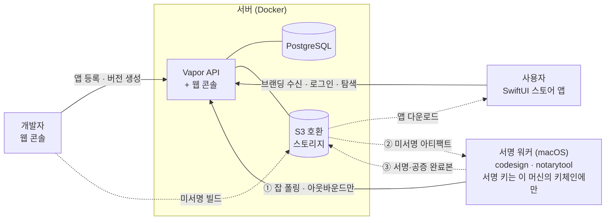
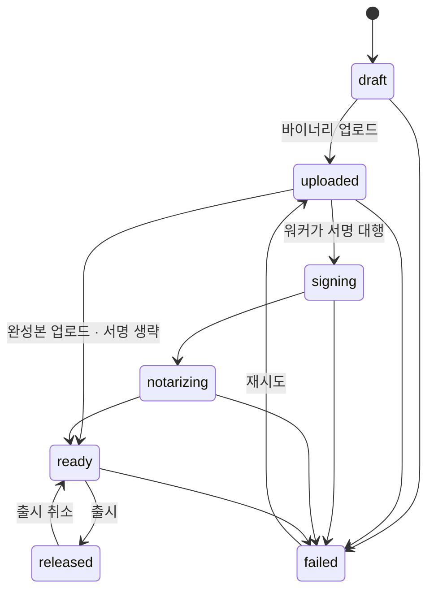

# Alley 설계 문서

조직 내부에서 macOS 앱을 배포하는 셀프호스팅 앱 스토어를 **무엇을 왜 이렇게**
만드는지에 대한 문서입니다.

무엇을 언제 만드는지는 [구현 계획](implementation-plan.md)을, 개별 결정의 배경과
버려진 대안은 [ADR](adr/README.md)을 보세요.

- 상태: 승인됨 (2026-08-12)
- 최종 갱신: 2026-08-13

---

## 1. 무엇을 만드는가

### 배경

조직 안에서 쓰는 Mac 앱을 나눠주는 과정은 보통 이렇습니다. 누군가 로컬에서 빌드하고,
서명하고, 공증을 기다리고, 결과물을 스토리지나 메신저로 올립니다. 받는 사람은 그게
최신인지, 누가 만들었는지, 안전한지 알기 어렵습니다.

Mac App Store를 쓰면 이 문제가 해결되지만, 조직 내부에서만 쓸 앱을 공개 스토어에
올릴 수는 없습니다. Alley는 그 사이의 빈자리를 채웁니다.

### 결정사항

| 항목 | 결정 |
| --- | --- |
| 클라이언트 | 웹 콘솔(개발자용) + 네이티브 SwiftUI 스토어 앱(사용자용) |
| 배포 형태 | Docker 셀프호스팅. 어떤 호스팅 환경도 전제하지 않음 |
| 서명 파이프라인 | 서버 + macOS 서명 워커(pull 방식). 서명 키는 워커 머신에만 |
| 기술 스택 | Swift 풀스택 (Vapor 서버 + Swift 워커 + SwiftUI 앱 + 공유 DTO 패키지) |
| 인증 | Google OAuth (OIDC). 허용 도메인은 서버 설정. 다운로드도 로그인 필수 |
| MVP 범위 | 코어 배포 루프 (로그인 → 업로드 → 자동 서명·공증 → 다운로드/설치) |

### 왜 Swift 풀스택인가

세 계층(서버, 워커, 스토어 앱)이 같은 DTO 타입을 공유합니다. API 스펙이 어긋나면
런타임이 아니라 컴파일 단계에서 잡힙니다. 워커와 스토어 앱은 어차피 macOS 전용이라
Swift일 수밖에 없으므로, 서버까지 통일하면 한 팀이 전 계층을 유지보수할 수 있습니다.

절충한 부분도 있습니다. Vapor 생태계는 Node나 Go보다 작아서 없는 라이브러리는 직접
만들어야 할 수 있고, 기여자 풀이 "서버를 아는 Swift 개발자"로 좁아집니다. 이 프로젝트는
Apple 플랫폼 개발자가 주인이므로 이 절충을 받아들였습니다.

---

## 2. 코드 서명에 대해 짚고 갈 점

이 프로젝트의 설계는 macOS 코드 서명의 다음 사실 위에 서 있습니다.

### 서명하는 것은 인증서지 프로비저닝 프로필이 아니다

Developer ID 배포(App Store 외부 배포)에서 Gatekeeper가 보는 것은 두 가지입니다.

1. 유효한 **Developer ID Application 인증서** 서명
2. **Apple 공증(notarization)** 티켓

프로비저닝 프로필은 이 판단에 관여하지 않습니다. Apple의
[Developer ID 문서](https://developer.apple.com/support/developer-id)도 프로필 없는
앱을 정상 케이스로 전제합니다.

### 프로필이 필요한 경우

앱이 **restricted entitlement**를 쓸 때입니다. iCloud/CloudKit, Push Notifications,
App Groups, Sign in with Apple, Associated Domains, Network Extension, DriverKit 등이
여기 해당합니다. 이 경우 프로필이 없으면 Gatekeeper 경고가 아니라 entitlement 검증
실패로 앱이 실행되지 않습니다.

Xcode의 자동 서명이 Developer ID 빌드에서도 App ID와 프로필을 만들어주기 때문에
"항상 필요한 것"으로 오해하기 쉽습니다.

### 설계에 미치는 영향

서명·공증을 스토어가 대행하므로 **개발자는 인증서를 직접 다룰 필요가 없습니다.**
이것이 이 프로젝트가 제공하는 실질적인 편의입니다.

다만 restricted entitlement를 쓰는 앱은 `Contents/embedded.provisionprofile`이
**서명 이전에** 번들 안에 있어야 하므로, 개발자가 업로드하는 번들에 프로필이 이미
포함돼 있어야 합니다. 워커는 업로드된 번들의 entitlements를 검사해서, restricted
항목이 있는데 프로필이 없으면 서명 전에 명확한 에러로 실패시킵니다. 서명은 됐지만
실행되지 않는 앱이 배포되는 상황을 막기 위해서입니다.

---

## 3. 번들 ID와 App ID 관리 정책

번들 ID와 개발자 포털의 App ID는 다른 개념이므로 분리해서 다룹니다.

### 번들 ID는 앱마다 고유해야 한다

공유할 수 없습니다. macOS가 번들 ID를 기준으로 LaunchServices 앱 등록,
`UserDefaults` 도메인, Application Support 경로, 키체인 접근 그룹, TCC 권한
(카메라/마이크/화면 녹화) 승인 단위를 결정하기 때문입니다. 스토어 DB의
`apps.bundle_id`도 유니크 키입니다.

### 포털의 App ID는 와일드카드로 묶을 수 있다

조직의 개발자 계정에 App ID 엔트리가 쌓이는 것을 막기 위해 3단 정책을 씁니다.

| 앱 유형 | 포털 등록 | 비고 |
| --- | --- | --- |
| 대부분의 내부 앱 | **등록 없음** | 번들 ID만 고유하게. 서명 + 공증만으로 배포 |
| 프로필은 필요하나 특수 capability 없음 | **와일드카드 App ID 1개 공유** (`<prefix>.*`) | 포털에 엔트리 하나만 유지 |
| Push / iCloud / App Groups / Sign in with Apple / Associated Domains 사용 | explicit App ID 개별 등록 | 와일드카드로 커버 불가능 |

### 스토어가 ID 대장 역할을 한다

번들 ID 프리픽스는 서버 설정값 `BUNDLE_ID_PREFIX`로 둡니다. 스토어는 앱 등록 시
프리픽스 준수와 중복 여부를 검증하고, 등록된 번들 ID 목록을 웹 콘솔에서 조회할 수
있게 합니다. 포털의 엔트리는 최소로 유지하면서 실제 ID 관리 책임은 스토어가 가져갑니다.

---

## 4. 아키텍처



실선은 API 호출이고, 점선은 presigned URL로 스토리지와 직접 주고받는 대용량
전송입니다. 바이너리는 서버를 통과하지 않습니다.

스토어 앱은 최초 실행 시 서버 주소만 입력받고, `/api/v1/meta`로 브랜딩과 인증
설정을 받아옵니다.

### 서명 워커가 pull 방식인 이유

워커는 서버로 **나가는 방향으로만** 통신합니다(long-poll). 서명 키를 보관한 머신에
외부에서 들어오는 포트를 열 필요가 없습니다. 서버를 컨테이너 플랫폼에 두고 워커만
격리된 물리 머신에 두는 구성이 자연스럽게 나옵니다.

대안으로 서명 머신에 서버 전체를 올리는 방법도 있었지만, 서비스 가용성이 빌드 머신에
묶이고 macOS에서의 서버 운영 부담이 커지며, 셀프호스팅 진입장벽이 생겨서 택하지
않았습니다. 바이너리 왕복 전송 비용은 공증 대기 시간(수 분)에 비하면 무시할 수준입니다.

### 조직 중립성 원칙

이 프로젝트는 오픈소스 공개를 전제로 합니다.

- 애플리케이션 코드는 표준 인터페이스만 압니다: PostgreSQL URL, S3 호환 엔드포인트,
  SMTP, Slack Webhook URL. 전부 환경변수 주입
- 특정 조직의 이름, 내부 호스트, 실제 계정 주소가 코드에 등장하지 않습니다
- 스토어 이름/로고/색상/허용 도메인은 서버가 `GET /api/v1/meta`로 내려줍니다.
  클라이언트 바이너리에는 조직 고유값이 들어가지 않습니다
- 조직별 배포 매니페스트(플랫폼 설정, 시크릿, 도메인)는 이 레포 밖에 둡니다
- `scripts/check-denylist.sh`가 CI에서 이 원칙을 강제합니다

### 레포 구조

```
alley-store/
├── Package.swift
├── Sources/
│   ├── AlleyShared/       # DTO, API 경로 (서버·워커·앱 공유, 외부 의존 없음)
│   ├── AlleyServer/       # Vapor API 서버 + 웹 콘솔
│   └── AlleyWorker/       # macOS 서명 워커
├── Tests/
├── StoreApp/              # SwiftUI 스토어 앱 (예정)
├── Web/                   # 웹 콘솔 리소스 (Leaf 템플릿 + 정적 파일)
├── scripts/
├── docker-compose.yml
├── Dockerfile
└── docs/
```

`AlleyShared`는 Vapor를 포함해 어떤 외부 프레임워크에도 의존하지 않습니다.
SwiftUI 스토어 앱이 그대로 임포트해야 하기 때문입니다. HTTP 직렬화 능력은
서버 쪽에서 덧붙입니다.

웹 콘솔은 MVP에서 Vapor + Leaf 서버 렌더링에 최소한의 JS로 갑니다. 화면이 복잡해지면
(통계, 피드백 대시보드) 그때 SPA 전환을 검토합니다.

---

## 5. 핵심 설계

### 5.1 인증

- 표준 OIDC Authorization Code 플로우. 서버가 콜백을 받아 자체 세션 토큰(JWT) 발급
- ID 토큰의 `hd`(hosted domain) claim과 이메일 도메인을 **서버 측에서** 허용 도메인
  설정과 대조합니다. 클라이언트 검증만으로는 우회할 수 있으므로 반드시 서버에서 봅니다.
  `email_verified`도 확인합니다
- 스토어 앱은 `ASWebAuthenticationSession`으로 같은 서버 플로우를 태웁니다
  (커스텀 URL 스킴 콜백)
- 역할: `admin` / `developer` / `user`
  - 최초 로그인 시 기본 `user`
  - 서버 설정의 초기 관리자 목록에 있으면 `admin`
  - `admin`이 웹 콘솔에서 `developer`로 승격
- 다운로드 API도 인증 필수. 누가 언제 무슨 버전을 받았는지 기록합니다

### 5.2 데이터 모델

| 테이블 | 주요 필드 |
| --- | --- |
| `users` | google_sub, email, name, avatar_url, role |
| `store_settings` | 스토어 이름, 로고, 허용 도메인, 초기 관리자, 번들 ID 프리픽스 (singleton) |
| `apps` | bundle_id, 이름, 아이콘, 설명, 카테고리, owner_id |
| `app_members` | app_id, user_id (앱별 업로드 권한) |
| `versions` | app_id, short_version, build_number, 릴리즈 노트, min_macos, 상태 |
| `artifacts` | version_id, kind(unsigned/signed), s3_key, sha256, size |
| `signing_jobs` | version_id, 상태, worker_id, 로그, 시도 횟수 |
| `workers` | 이름, 토큰 해시, 마지막 폴링 시각 |
| `downloads` | user_id, version_id, timestamp |

버전 상태 머신:



로컬에서 이미 서명·공증을 마친 완성본을 올리는 경로는 `uploaded → ready`로 서명
단계를 건너뜁니다. 실패하면 업로드된 바이너리부터 다시 시작합니다.

전이 규칙은 `VersionState.allowedNextStates`에 박아두어 단계를 건너뛰는 경로를
타입 수준에서 막습니다. 위 그림과 코드가 어긋나면 코드가 기준입니다.

### 5.3 서명 워커

- Swift 실행 파일 + `launchd` LaunchAgent. 설치 스크립트 제공
- 워커가 서버로 long-poll (`GET /api/v1/worker/jobs/next`). 인바운드 포트 불필요
- 워커 등록: 관리자가 웹 콘솔에서 토큰 발급 → 워커 설정에 기입
- 잡 처리 순서:
  1. 잡 클레임 → presigned URL로 미서명 아티팩트 다운로드
  2. entitlements 검사 (restricted 항목이 있는데 프로필이 없으면 여기서 실패)
  3. `codesign --force --options runtime --sign "..."` (내부 프레임워크·헬퍼 포함
     inside-out 서명)
  4. `xcrun notarytool submit --wait`
  5. `xcrun stapler staple`
  6. 결과물을 presigned URL로 업로드, 상태·로그 보고
- 공증 자격증명은 환경변수가 아니라 `notarytool` 키체인 프로필 방식을 씁니다.
  자격증명이 프로세스 환경에 노출되지 않습니다
- `alley-worker preflight`로 설치 직후 환경을 점검합니다. 잡을 받은 뒤에 환경 문제를
  발견하면 원인 파악이 번거롭기 때문입니다
- 워커를 여러 대 등록할 수 있게 설계합니다. 큐가 서버에 있으므로 워커가 죽어도
  복구 시 이어서 처리합니다

### 5.4 스토어 앱

- 최초 실행: 서버 주소 입력 → `/api/v1/meta`로 브랜딩·인증 설정 수신
- 로그인 → 앱 목록/검색/상세 → presigned URL 다운로드 → 설치
- 스토어 앱 자체의 첫 배포는 웹 콘솔에서 직접 다운로드합니다 (부트스트랩)

#### 샌드박스를 쓰지 않는다

스토어 앱은 App Sandbox 없이, Hardened Runtime만 켜서 배포합니다.

이 앱이 하는 일은 `/Applications`에 앱을 쓰고, 업데이트할 때 실행 중인 대상 앱에
종료를 요청하는 것입니다. 샌드박스는 정확히 그 둘을 막습니다. 우회하려면 사용자가
매번 설치 위치를 직접 고르거나 별도 권한 헬퍼를 두어야 하는데, 보안은 늘지 않고
사용성만 나빠집니다. Developer ID 배포는 샌드박스를 요구하지도 않습니다.

대신 다음으로 방어합니다.

- **Hardened Runtime** (공증 요건이기도 합니다)
- **설치 전 서명 검증**: 내려받은 앱을 `codesign --verify --deep --strict`로 확인하고
  Team ID가 기대값과 같은지 대조합니다. 서버가 침해되어 다른 바이너리를 내려줘도
  클라이언트에서 걸립니다. 스토어 앱을 샌드박싱하는 것보다 이쪽이 실질적입니다
- **SHA-256 대조**: 서버가 알려준 해시와 내려받은 파일을 대조합니다
- **quarantine 속성 유지**: 첫 실행 시 macOS 표준 Gatekeeper 검증을 그대로 태웁니다

#### 설치 위치

`/Applications`가 기본입니다. 관리자 계정이면 그대로 쓰고, 쓰기 권한이 없으면
`~/Applications`로 폴백합니다. 폴백했다는 사실을 사용자에게 알립니다.

### 5.5 앱 업데이트

업데이트 경로를 두 갈래로 지원합니다. 스토어 앱이 관리하는 경로가 기본이고,
개별 앱이 스스로 업데이트하고 싶으면 Sparkle을 붙일 수 있습니다.

#### 왜 두 갈래인가

스토어 앱만으로 가면 스토어 앱이 안 떠 있는 동안에는 업데이트가 안 됩니다.
Sparkle만으로 가면 모든 앱에 SDK를 통합해야 하고, 통합하지 않은 앱은 영영
업데이트되지 않습니다. 둘 다 열어두면 앱 개발자가 상황에 맞게 고를 수 있고,
이미 Sparkle을 쓰던 앱은 서버 URL만 바꿔서 그대로 흡수됩니다.

appcast는 XML 엔드포인트 하나라 구현 비용이 거의 없습니다.

#### 경로 A: 스토어 앱이 관리

설치된 앱 탐지:

1. `/Applications`와 `~/Applications`를 스캔해 각 번들의 `CFBundleIdentifier`와
   `CFBundleVersion`을 읽습니다
2. 스토어에 등록된 번들 ID와 대조해 설치 여부와 버전을 판단합니다
3. 사용자가 다른 위치에 설치한 앱은 `NSWorkspace.urlForApplication(withBundleIdentifier:)`로
   보완 조회합니다. 그래도 못 찾으면 미설치로 간주하고, 설치를 시도할 때 중복이
   감지되면 사용자에게 알립니다

교체 절차:

1. 새 버전을 받아 서명·해시를 검증합니다 (5.4의 설치 전 검증과 동일)
2. 대상 앱이 실행 중이면 사용자에게 알리고 동의를 받은 뒤
   `NSRunningApplication.terminate()`로 정상 종료를 요청합니다. 응답이 없으면
   강제 종료하지 않고 "나중에 업데이트"로 미룹니다. 저장하지 않은 작업을
   날리는 것보다 업데이트가 늦는 편이 낫습니다
3. 기존 번들을 휴지통으로 옮기고 새 번들을 같은 위치에 놓습니다.
   교체 중 실패하면 옮겨둔 기존 번들을 되돌립니다
4. 업데이트 전에 실행 중이었다면 다시 실행합니다

MVP에서는 사용자가 버튼을 눌러 업데이트합니다. 백그라운드 자동 확인은 Phase 4입니다.

#### 경로 B: Sparkle appcast

서버가 앱별로 appcast를 서빙합니다.

```
GET /api/v1/apps/:id/appcast.xml
```

앱에 Sparkle을 통합하고 이 URL을 `SUFeedURL`로 지정하면 스토어 앱 없이도 자체
업데이트가 됩니다. appcast에는 released 상태인 버전만 나갑니다.

인증이 문제가 됩니다. 다른 API는 전부 로그인을 요구하는데 Sparkle은 세션 토큰을
들고 있지 않습니다. appcast와 그 안의 다운로드 URL은 앱별 피드 토큰으로 인증합니다.
토큰은 웹 콘솔에서 앱 단위로 발급·회전할 수 있게 합니다. 사용자 단위 다운로드
이력이 남지 않는다는 한계가 있으므로, 이력이 중요한 앱은 경로 A를 씁니다.

#### 스토어 앱 자신의 업데이트

스토어 앱은 Sparkle을 씁니다. 실행 중인 자기 자신을 교체하는 것은 별도 헬퍼
프로세스가 필요한 까다로운 작업이고, Sparkle이 이미 해결해둔 문제를 다시 푸는 것은
낭비입니다. Sparkle의 EdDSA 서명 검증도 그대로 활용합니다.

### 5.6 API 개요

```
GET   /health                          # 헬스체크
GET   /api/v1/meta                     # 브랜딩·인증 설정 (비인증)
GET   /auth/google, /auth/google/callback
POST  /api/v1/auth/token               # 앱용 토큰 교환
GET   /api/v1/me
GET   /api/v1/apps,  POST /api/v1/apps
GET   /api/v1/apps/:id,  PATCH /api/v1/apps/:id
POST  /api/v1/apps/:id/versions        # 버전 생성 + 업로드 URL 발급
POST  /api/v1/versions/:id/complete    # 업로드 완료 통지 → 서명 잡 생성
POST  /api/v1/versions/:id/release
GET   /api/v1/versions/:id/download    # 인증 → 이력 기록 → presigned URL
GET   /api/v1/apps/:id/appcast.xml     # Sparkle 피드 (앱별 피드 토큰 인증)
GET   /api/v1/worker/jobs/next         # 워커 long-poll (워커 토큰 인증)
PATCH /api/v1/worker/jobs/:id          # 상태·로그 보고
POST  /api/v1/admin/workers            # 워커 등록 토큰 발급
```

경로 상수는 `AlleyShared/APIPath.swift`에서만 정의합니다. 서버·워커·앱이 각자
문자열을 하드코딩하면 스펙이 어긋나기 때문입니다.

---

## 6. 리스크와 대응

| 리스크 | 대응 |
| --- | --- |
| 서명 워커 단일 장애점 | 큐는 서버 보관, 복구 시 이어서 처리. 워커 다중 등록 가능. 하트비트로 다운 감지 후 알림(Phase 3) |
| 서명 키 유출 | 키는 워커 머신 키체인에만. 워커 토큰은 해시 저장 + 회전 가능. 서명은 서버가 검증한 잡에 한정 |
| 공증 지연 / Apple 장애 | `notarytool --wait` 타임아웃 + 재시도. 상태를 웹 콘솔에 투명하게 노출 |
| OAuth `hd` claim 우회 | 이메일 도메인 + `hd` + `email_verified` 이중 검증을 서버에서 수행 |
| 대용량 업로드 실패 | S3 multipart. MVP는 단순 재시도, 재개 가능 업로드는 후속 |
| Vapor 생태계 한계 | OAuth/S3/JWT는 검증된 라이브러리 존재. 없는 것은 REST 직접 호출로 대체 |
| 조직 정보가 git 히스토리에 유입 | 처음부터 조직 값은 레포 밖 시크릿으로 분리. CI deny list. 공개 전 히스토리 청소가 필요 없는 구조 |
| 스토어 앱 첫 설치 배포 | 웹 콘솔에서 직접 다운로드(부트스트랩), 이후 자체 업데이트 |

개별 설계 결정의 트레이드오프는 각 [ADR](adr/README.md)의 "결과" 절에 있습니다.
여기 표는 설계 전반에 걸친 위험만 다룹니다.
